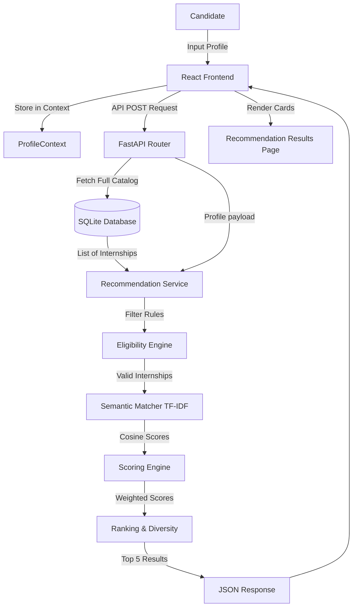

# Project Flow

## 1. Project Overview

The SIH Internship Recommendation project is a mobile-friendly web application designed to help students and candidates find the most suitable internships based on their profile. It solves the problem of information overload by automatically filtering, scoring, and ranking internships according to a candidate's education, skills, interests, and location preferences. 

The architecture consists of a React frontend that collects user preferences through a multi-step form, and a FastAPI backend that processes the data. The backend uses a hybrid recommendation engine combining hard eligibility rules, TF-IDF semantic matching, and weighted feature scoring to provide explainable and diverse top recommendations.

## 2. Technology Stack

| Technology | Where it is used | Purpose |
| ---------- | ---------------- | ------- |
| **React** | Frontend | UI component rendering and application logic |
| **Vite** | Frontend | Build tool and development server |
| **Tailwind CSS** | Frontend | Utility-first CSS styling |
| **React Router** | Frontend | Client-side routing across multi-step forms |
| **FastAPI** | Backend | High-performance Python REST API framework |
| **SQLAlchemy** | Backend | ORM for database interactions |
| **SQLite** | Database | Relational database (`sih_recommender.db`) storing candidates, users, and internships |
| **scikit-learn** | Backend Recommender | Computing TF-IDF matrices and cosine similarity for semantic matching |
| **Axios** | Frontend | HTTP client for making API requests to the backend |

## 3. Folder Structure

```text
c:\Project\
├── backend/
│   ├── main.py                 # FastAPI application entry point
│   ├── database.py             # SQLite database connection and CSV seeding
│   ├── models.py               # SQLAlchemy ORM models (Candidate, User, Internship)
│   ├── schemas.py              # Pydantic validation schemas for API
│   ├── routes/                 # API endpoint handlers (recommendations, candidates, etc.)
│   ├── services/               # Adapter layer bridging API and recommender logic
│   └── recommender/            # Core recommendation engine logic
│       ├── config.py           # Scoring weights and synonym mappings
│       ├── eligibility.py      # Hard filtering rules (deadline, degree, branch)
│       ├── similarity.py       # TF-IDF semantic scoring 
│       ├── scoring.py          # Weighted scoring formula implementation
│       └── recommender.py      # Orchestrator for filtering, scoring, and ranking
├── frontend/
│   ├── src/
│   │   ├── App.jsx             # Main React component and router definition
│   │   ├── components/         # Reusable UI components (LocationSelector, InternshipCard)
│   │   ├── context/            # React Context API (ProfileContext)
│   │   ├── pages/              # Page views (CandidateProfile, LocationPreferences, etc.)
│   │   └── services/           # API integration (api.js)
├── data/
│   ├── candidates.csv          # Candidate dataset
│   ├── internships.csv         # Synthetic internship dataset used for DB seeding
│   └── sih_recommender.db      # SQLite database generated from CSV
└── scripts/                    # Utility scripts (e.g., updating locales)
```

## 4. Complete User Flow

```text
User opens application
        ↓
Welcome Page (/)
        ↓
Candidate Profile (Education & Branch)
        ↓
Skills & Interests Form
        ↓
Specific Interests Form
        ↓
Location Preferences (State, City, Work Style, Duration)
        ↓
Profile Submitted via API (/candidates)
        ↓
Recommendation Requested via API (/recommendations)
        ↓
Backend Recommender Engine Processes Profile
        ↓
Top 5 Internship Matches Ranked
        ↓
Recommendation Results Page (/results) displaying 5 cards
        ↓
User clicks card -> Internship Details Page
```

## 5. Frontend Flow

*   **Entry point**: `frontend/src/main.jsx` rendering `App.jsx`.
*   **Main pages**: `Welcome.jsx`, `CandidateProfile.jsx`, `SkillsInterests.jsx`, `Interests.jsx`, `LocationPreferences.jsx`, `RecommendationResults.jsx`, `InternshipDetails.jsx`.
*   **Navigation**: Managed by `react-router-dom` in `App.jsx`.
*   **State management**: Handled globally via `ProfileContext.jsx`. The `useProfile` hook provides access to the `profile` object, `updateProfile` function, and `recommendations`.
*   **Form flow**: Users navigate sequentially through pages. As they fill out forms, `updateProfile` updates the context.
*   **API Calls**: Centralized in `services/api.js`. `validateCandidateProfile` checks data before submission. `submitCandidate` saves the profile, and `fetchRecommendations` retrieves the matches.
*   **Display**: `RecommendationResults.jsx` displays loading, error, empty, or ready states. When ready, it maps the top 5 matches into `RecommendationList.jsx`.

## 6. Candidate Profile Flow

Candidate information is collected incrementally and stored in `ProfileContext`.

**Fields Collected**:
*   `education`: Degree/Course
*   `branch`: Specific subject
*   `skills`: Array of skills
*   `interests`: Array of work interests
*   `preferred_sectors`: Array of sectors
*   `preferred_states`: Array of states
*   `preferred_cities`: Array of cities
*   `preferred_location_type`: e.g., On-site, Hybrid, Remote
*   `preferred_duration`: Integer in months
*   `experience_level`: e.g., No prior experience

**Data Flow**:
```text
User Input (Form fields)
   ↓
onChange triggers updateProfile()
   ↓
Frontend State (ProfileContext updates)
   ↓
Validation (validateCandidateProfile in api.js)
   ↓
API Request (POST /api/recommendations) using profilePayload() formatting
   ↓
Backend FastAPI (parsed via Pydantic schemas)
```

## 7. State → City Flow

Implemented primarily in `frontend/src/components/LocationSelector.jsx`.

*   **State Storage**: States are fetched from `/api/states` (or fallback hardcoded list) and rendered as toggle buttons.
*   **Multiple States**: Managed as an array (`preferred_states`) in the context. Toggling a state adds/removes it from the array.
*   **City Mapping**: A hardcoded dictionary `stateCityMap` maps states to their respective cities directly in the frontend component.
*   **City Filtering**: The component dynamically computes `availableCities` by reducing the selected `preferred_states` and concatenating cities from `stateCityMap`.
*   **Selection Logic**:
    *   *Select State*: The state is added to `preferred_states`. The UI immediately renders available cities for that state.
    *   *Deselect State*: The state is removed. The available cities list shrinks. (Note: currently, deselected state cities might remain in `preferred_cities` state until submission filtering).
*   **Example**:
    *   User selects "Gujarat". `availableCities` populates with "Ahmedabad, Surat, Vadodara...".
    *   User selects "Madhya Pradesh". `availableCities` appends "Indore, Bhopal, Jabalpur...".
    *   User can now select "Ahmedabad" and "Indore" as preferred cities.

## 8. Backend Flow

```text
Frontend Axios Request
   ↓
FastAPI Router (routes/recommendations.py)
   ↓
Database Session Dependency injected
   ↓
RecommendationService (services/recommendation_service.py)
   ↓
InternshipRecommender initialized with all DB internships
   ↓
Recommender Engine (Eligibility -> Similarity -> Scoring -> Ranking)
   ↓
Final top 5 results formatted (extracting reasons, match %)
   ↓
Response returned as JSON (RecommendationResponse schema)
   ↓
Frontend Results Page
```

## 9. Dataset / Database

*   **Storage**: SQLite database (`sih_recommender.db`) located in the `data/` folder.
*   **Tables/Models**:
    *   `candidates`: Stores user profiles.
    *   `internships`: Stores the catalog.
    *   `users`: Authentication table.
*   **Loading**: `database.py` contains `seed_internships` which reads `data/internships.csv` on startup and bulk inserts records if the table is empty.
*   **Dataset Structure** (`internships` table):
    *   `internship_id` (PK)
    *   `job_title`, `company_name`, `sector`, `description`
    *   `required_skills`, `eligible_branches` (Stored as JSON text strings)
    *   `states`, `cities`, `location_type`
    *   `stipend`, `duration_months`, `experience_required`
*   **Querying**: In `RecommendationService`, `database.query(Internship).all()` fetches the entire active catalog into memory for the recommender engine.

## 10. Recommendation Engine

The engine (`backend/recommender/recommender.py`) uses a pipeline approach: Filter -> Semantic Match -> Score -> Rank.

**1. Eligibility Filtering** (`eligibility.py`):
Strict boolean rules. Internships are excluded if:
*   Application deadline has passed.
*   Candidate's degree rank is strictly lower than minimum requirement.
*   Degree string does not match preferred education.
*   Branch does not match eligible branches.
*   Candidate has "no prior" experience but internship has "mandatory" experience required.

**2. Semantic Matching** (`similarity.py`):
Uses `scikit-learn` `TfidfVectorizer` (1-2 ngrams) to convert candidate skills/interests and internship title/desc/skills into numerical vectors. Calculates Cosine Similarity between them.

**3. Feature Scoring** (`scoring.py`):
Computes individualized scores [0.0 - 1.0] based on normalized matching:
*   `skill`: Blends exact overlap (60%) with semantic TF-IDF score (40%).
*   `interest`: Overlap between candidate interests and internship sector.
*   `education`: Matches branch and broad education constraints.
*   `location`: City match (1.0), State match (0.8), Work mode match (0.5).
*   `duration`: Penalty based on absolute difference from preferred duration.
*   `experience`: Boosts if experience matches.
*   `stipend`: Ratio of offered vs requested minimum stipend.

**4. Weighted Calculation**:
```text
Final Score =
    (Skill * 0.35)
  + (Interest * 0.25)
  + (Education * 0.15)
  + (Location * 0.10)
  + (Duration * 0.05)
  + (Experience * 0.05)
  + (Stipend * 0.05)
```

**5. Ranking & Diversity** (`ranking.py` / `config.py`):
Results are sorted by Final Score descending. A diversity algorithm penalizes subsequent internships from the same company (20% penalty), same sector (8%), or same state (3%) to ensure the candidate gets a varied top 5 selection.

## 11. Recommendation Request Flow

```text
Candidate fills profile in React UI
        ↓
User clicks "Find Internships"
        ↓
Frontend API Client sends POST profile payload
        ↓
FastAPI `/api/recommendations` endpoint hit
        ↓
Backend fetches all active internships from SQLite DB
        ↓
Eligibility check removes unqualified internships
        ↓
TF-IDF calculates semantic matrix for eligible subset
        ↓
Weighted Score formula applied to each valid internship
        ↓
Internships sorted by score
        ↓
Diversity penalties applied iteratively
        ↓
Top 5 internships sliced and formatting applied (match %, reasons)
        ↓
API Response returned
        ↓
React `RecommendationResults` maps JSON to UI Cards
```

## 12. Internship Recommendation Output

For each of the Top 5 recommended internships, the backend returns:
*   **Rank/Limit**: Only top 5.
*   **Basic Info**: `internship_id`, `job_title`, `company_name`, `sector`, `city`, `state`.
*   **Details**: `stipend` (int), `duration` (months).
*   **Scoring Visibility**:
    *   `match_percentage`: Float representing the final score * 100.
    *   `matched_skills`: Array of exact skill overlaps found.
    *   `reasons`: Array of human-readable explanation strings generated by `explanations.py` (e.g., "Matches your preferred location", "Strong skill match").

## 13. API Documentation

| Method | Endpoint | Purpose | Request | Response |
| ------ | -------- | ------- | ------- | -------- |
| `POST` | `/api/candidates` | Saves candidate profile to DB | `CandidateProfile` JSON | `CandidateCreateResponse` (Includes ID) |
| `POST` | `/api/recommendations` | Core engine endpoint. Returns top 5. | `CandidateProfile` JSON | `RecommendationResponse` (Profile + 5 Items) |
| `GET` | `/api/internships/{id}`| Fetches single internship details | Path Param: ID | `InternshipDetail` JSON |
| `GET` | `/api/sectors` | Gets unique sectors for dropdowns | None | `OptionsResponse` (Array of strings) |
| `GET` | `/api/states` | Gets unique states for dropdowns | None | `OptionsResponse` (Array of strings) |
| `POST` | `/api/register` | Registers a new user | Auth JSON | Auth Token / Status |
| `GET` | `/api/health` | API Healthcheck | None | `HealthResponse` |

## 14. Data Flow Diagram



## 15. Important Functions

| Function | File | Purpose | Input | Output |
| -------- | ---- | ------- | ----- | ------ |
| `validateCandidateProfile` | `api.js` | Validates form data before API call | Profile object | Error string or null |
| `updateProfile` | `ProfileContext.jsx` | Updates global React state | Changes object | None (Updates Context) |
| `recommend` | `recommendation_service.py` | Adapts DB models to Recommender | Profile, Limit | List of Formatted Dicts |
| `recommend` | `recommender.py` | Orchestrates filtering/scoring steps | Profile, Limit | Ranked list of Dicts |
| `filter_eligible` | `eligibility.py` | Executes hard inclusion/exclusion | Profile, Internships | Filtered Internships |
| `tfidf_scores` | `similarity.py` | Calculates semantic text similarity | Profile, Internships | List of floats (0-1) |
| `feature_scores` | `scoring.py` | Calculates specific feature scores | Profile, Internship | Dict of component scores |
| `weighted_score` | `scoring.py` | Calculates final aggregated score | Scores Dict | Float (Final Score) |
| `diversify` | `ranking.py` | Penalizes repetitive recommendations | Ranked Internships | Top N diverse Internships |

## 16. Complete Example

**Candidate:**
*   Education: B.Tech
*   Branch: Computer Engineering
*   Skills: Python, React, SQL
*   Interests: AI, IT
*   States: Gujarat
*   Cities: Ahmedabad
*   Duration: 3 months

**System Processing:**
1.  **UI**: User submits form. `api.js` sends JSON to `/api/recommendations`.
2.  **Eligibility**: Backend loads DB. Discards internships requiring "Postgraduate" or branches like "Mechanical". Keeps IT/CS internships.
3.  **Semantic**: `TfidfVectorizer` computes high similarity for internships containing "AI", "Python", "React" in descriptions.
4.  **Scoring**:
    *   Internship A (Ahmedabad, Python, AI, 3 months): High Location (1.0), High Skill (0.9), High Duration (1.0). Total ~0.92.
    *   Internship B (Surat, React, IT, 6 months): State Match (0.8), High Skill (0.8), Duration Penalty (0.25 diff -> 0.81). Total ~0.75.
5.  **Ranking**: Internship A is ranked #1. Internship B ranked #2. Diversity checks ensure no overwhelming bias if A & B are from the same company.
6.  **Output**: Top 5 returned. Frontend maps to cards showing "92% Match" with reason "Matches your preferred location and skills".

## 17. Error Handling

*   **Frontend Validation**: `validateCandidateProfile` blocks submission if required fields (Education, Branch, Skills) are empty.
*   **Loading States**: `status === 'loading'` displays `LoadingState.jsx` while awaiting the API.
*   **Empty Results**: If the backend returns an empty array (no eligible internships), `status === 'empty'` displays a specific "No results found" UI prompting to update choices.
*   **API Errors**: Axios `.catch()` updates status to `'error'`. `ErrorState.jsx` shows generic fallback or detailed error (`error.response.data.detail`).
*   **Backend Exceptions**: Unhandled FastAPI errors are caught by `unhandled_error_handler` in `main.py`, returning a safe 500 JSON payload instead of crashing.
*   **Empty Text Safeties**: `similarity.py` includes safe handling if text strings are entirely empty, returning 0.0 instead of crashing `scikit-learn`.

## 18. Current Limitations

*   **Memory Footprint**: `RecommendationService` loads the *entire* internship catalog into memory (`database.query(Internship).all()`) on every request. This will not scale to millions of records.
*   **City Map Hardcoding**: `stateCityMap` is hardcoded in the frontend React component. Updating valid cities requires a frontend code deployment.
*   **TF-IDF Vocabulary**: Semantic matching relies on exact statistical word overlaps. While `config.py` provides some manual synonyms, it might miss conceptually identical terms not explicitly mapped.
*   **Dataset Structure**: `required_skills` and `eligible_branches` are stored as JSON-encoded text strings in SQLite rather than normalized relational tables, making direct SQL querying inefficient.
*   **Deselection Edge Case**: In the UI, deselecting a state does not automatically purge previously selected cities belonging to that state from the `preferred_cities` array.

## 19. Future Improvements

*   **Scalability**: Implement vector embeddings (e.g., pgvector) and SQL-level pre-filtering (filtering by State/City at the DB query level) instead of loading all rows into Python memory.
*   **Semantic Upgrades**: Replace TF-IDF with lightweight Sentence Transformers (e.g., MiniLM) for true contextual understanding of skills and descriptions without needing manual synonym dictionaries.
*   **Dynamic Locations**: Move `stateCityMap` logic to a backend API endpoint driven by the actual dataset, ensuring users only select cities that exist in the catalog.
*   **Normalized DB**: Move skills, cities, and branches into separate link tables (many-to-many) for robust indexing and faster SQL lookups.
*   **Caching**: Implement Redis to cache frequent candidate profile archetypes and their resulting top recommendations.

## 20. Final End-to-End Summary

```text
Candidate (React UI)
   ↓
Profile Collection (Context API)
   ↓
API Request (FastAPI /recommendations)
   ↓
Internship Dataset (Loaded from SQLite)
   ↓
Filtering (Eligibility bounds: Degree, Deadline, Experience)
   ↓
Matching / Scoring (TF-IDF Semantics + Weighted Formula)
   ↓
Ranking (Sorted by Final Score + Diversity Penalties)
   ↓
Top 5 Recommendations (Reasons & Match % attached)
   ↓
User (Results Dashboard)
```
